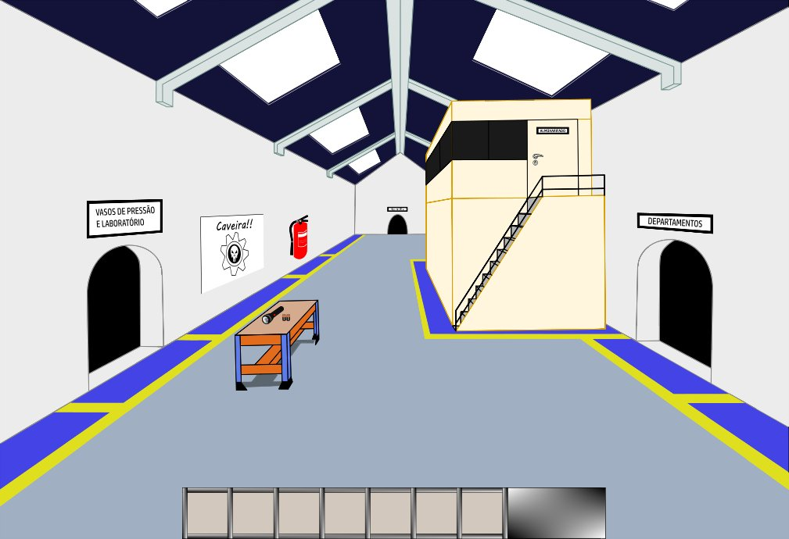

# Mechanical Apprentice

Adventure game for mechanical technicians (Unfinished)



This game was built for my term paper at the end of my Associate Degree in Mechanics (between July/2017 ~ December/2017).

But, due to health issues, I couldn't finish the game.

## How to run the game

**Easiest way** (Windows only) : You can download the [executable](https://aprendiz-de-mecanico.sourceforge.io/) on my SourceForge page.

**Common way** : In the ```./development``` folder, open the terminal and type ```python main.py```. Dependencies:
  - At least **Python 3.6** installed;
  - At least **Pygame 1.9.3** installed.
  
If you want to build the executable, you will need to have **Python 3.6** and **PyInstaller 3.3.1** installed . After that, open the terminal
in the ```./executable/demo``` folder and type ```pyinstaller main.spec```. In the ```dist``` folder, there'll be an executable.
If any problem occurs, checkout the PyInstaller [Documentation](https://pyinstaller.readthedocs.io/en/stable/index.html).

## Contributing

Pull requests are welcome :)

## License

See the [LICENSE](LICENSE) file for license rights and limitations.
